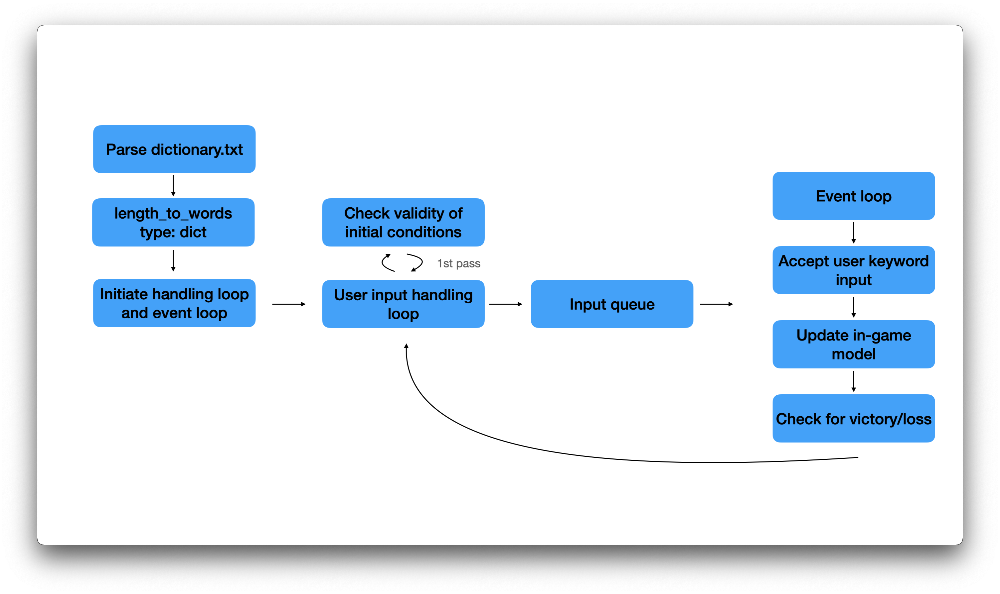
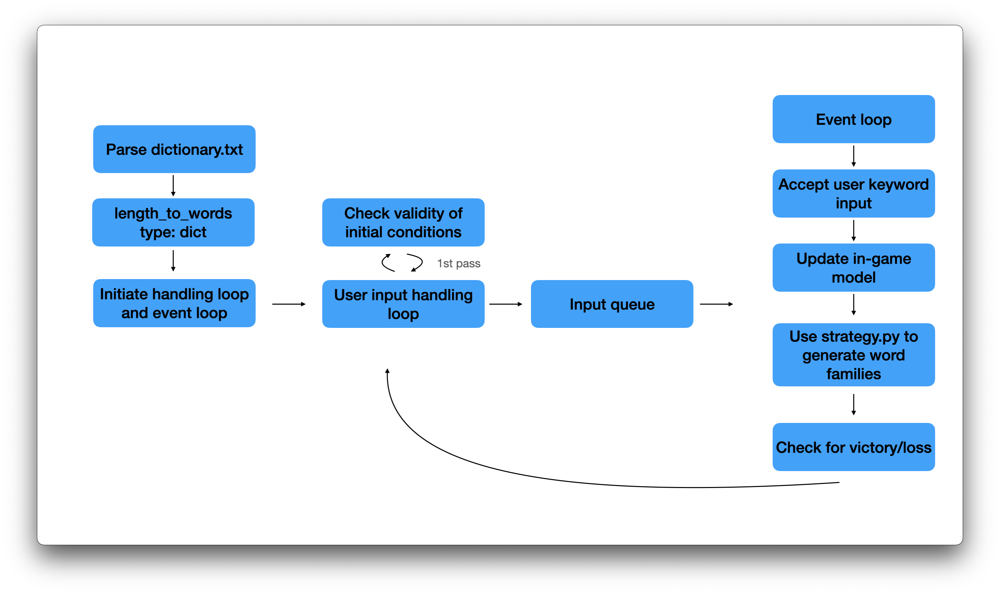

Hangman

A basic hangman game in python

Installation:

Run `pipenv shell` to use pipfile to start virtualenv, then `pipenv install` to install dependencies. Run `python -m lib.main` to run the game.

Evil layout:

